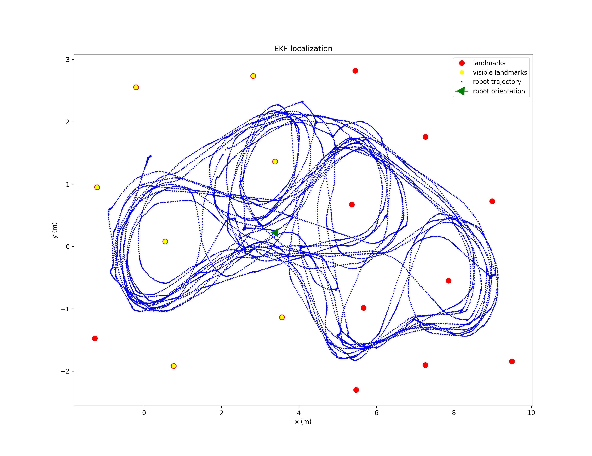
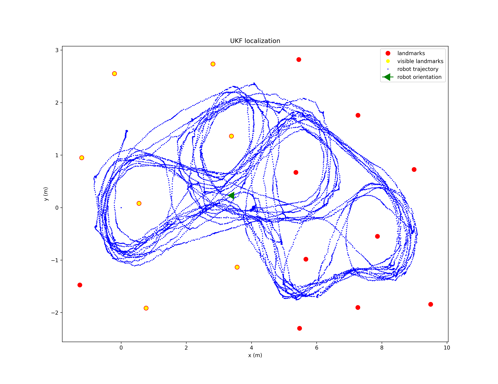

# Kalman-Filters

## Summary
In this Repository, I have implemented EKF and UKF localization algorithms using landmarks and their accuracy has been compared.

-----------------
## Dataset
Victoria Park Dataset: http://www-personal.acfr.usyd.edu.au/nebot/victoria_park.htm

-----------------

## EKF

### Demo

### Accuracy

**average x error:** 0.039 \
**average y error:** 0.052 \
**average theta error:** 0.029

## UKF

### Demo

### Accuracy
**average x error:** 0.026 \
**average y error:** 0.023 \
**average theta error:** 0.030

-----------------

## Comparisons

| Metric      | EKF         | UKF |
| ----------- | ----------- | ----------- |
| average x error      | 0.039 | **0.026**|
| average y error      | 0.051 | **0.023**|
| average theta error  | **0.029** | 0.030|